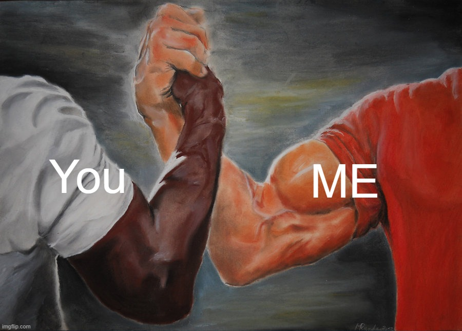

# Welcome to Week-1

Here we have quite generic resources used by everyone for the most basic python libraries used in data analysis parts. For those new to python, welcome to the modern world :p. 

Jokes aside, everyone is used to (or at least know a bit of) cpp from CS101. Python is easier which is mostly people's issue with it. Generally, in the pre-AI era ppl were advised to learn both (Not sure about now). But whatever, python is convenient that's all. *(Not more convenient than your LLM)*

---

## Learning Python

You will be learning python in a week, to put that in perspective, I learnt python for 2 years in my school.

  
   
  <em>Me realizing I have to learn in 7 days what school taught in 730 days.</em>

...Yeaah, welcome to IITB. Get used to this, every IITB lab expects you to know any language in a week (in worst cases a day) 😇. For those used to this (any 2nd years or above) I feel you.

  

Anyways, you will be doing only the absolute basics as far as python is considered, to get you used to it there will be coding assignments for every week, with 1st week being heavy in quantity.

---

## Why These Libs?

  

In life, better to ask why everywhere and for whatever you do. But leaving philosophy aside, knowing why you are doing something is what keeps you going.

**Libs to learn:**
1. `numpy`
2. `matplotlib`
3. `seaborn`
4. `pandas`
5. `scikit-learn`

### 1. NumPy
**`numpy`** is gold (or petroleum) when you are dealing with matrices/vectors in python. In deep learning, matrices/vectors are everywhere while usually pytorch (another lib) is used nowadays. The truth is, advanced frameworks hide how data is actually structured. For example, when libraries handle datasets under the hood, they automatically stack data into "batches" (like processing 32 images at once in parallel). If you just rely on the library wrappers, you lose sight of how rows, columns, and dimensions actually interact.

In numpy, there is no magic abstraction hiding the dimensions. If your matrix dimensions don't align perfectly for a dot product, numpy will throw an error right in your face. We are using numpy this week so you learn to consciously think about how data arrays are shaped, sliced, and manipulated. Master the matrix math in numpy now, and handling complex data pipelines later will feel like a breeze. Thus in this project when you need to understand something on a base level, we will be using numpy. Hopefully, writing in numpy is as comfy as writing in your notebook by the end of this project.

### 2. Matplotlib
**`matplotlib`** is just a plotting library used to generate colorful plots (to light up your bleak life). If you know anything about models, you know that they are usually evaluated through some metrics like RMSE, R^2, AUC-ROC, etc. depending on model. These metrics tell us how good our model functions and knowing how to interpret them is what helps you debug a model. Plots are used to evaluate the model more thoroughly, after all a single metric cannot provide you everything and plotting those metrics gives you a better visual view of what's going on and you next steps.

### 3. Seaborn
**`seaborn`** is just a more colorful matplotlib.

### 4. Pandas
**`pandas`** is well a convenient tool for handling datasets, Machine Learning (or Deep Learning) involves learning from data, and so you need to handle this data nicely (like a newborn baby), and what better to calm a baby than a panda :p.

> 🥁 *[Listen to the mandatory "Ba-dum-tss" drum roll here for that terrible pun](https://www.youtube.com/watch?v=6DC9xez5pxU)*

### 5. Scikit-Learn
**`scikit-learn`** - Contains the traiditional ML algorithms (like Linear Regression, SVM's and clustering), we won't be doing this in the "official" sense, but you may find mentions or uses.

---

## A few Ground Rules

AI is great for coding, but hopefully you don't (need to) use it in this project much. As mentioned in the numpy section, coding things up by hand gives you a more deeper view of things helping you find places where you though you understood the theory but actually didn't. Coding with AI is nice when you have the theory clear in your head and know how it works and when you just wanna quickly prototype your model, but when it comes to learning no use.

*   **Ask for Help:** I will be doing my best to give you assignments which don't require you to do much prompting, since the goal is understanding the theory and make you comfortable with coding, but do reach out to any of the mentors if you feel any difficulties. And yeah we ain't gonna cut your certification or something, we are just here to help you learn something we know already. If you don't understand something, keeping it to yourself is the only real problem. So don't be shy, ask questions, and make the most out of this project.
*   **AI Code Policy:** If I do think that some assignment is too hard for you to do now on code or like your time is too short then I will be saying to use AI for code, but expect me to grill you hard on the code used by you.

> 💡 **A Wise Note from my DS Prof:** 
> *"Coding may be done by your chatbot, but the responsibility is all yours."*

On the off-chance you do use AI when it is not explicitly mentioned and haven't really asked your mentors about it, you can expect me to be quite sad 😔 about it and grill you hard again. IF you really can't code an assignment, then discuss with a mentor, we are quite harmless trust me.

> 🐉 *[This is us - We-Hiccup, You-Toothless and Fish-This Project](https://www.youtube.com/shorts/2gRYKuHgTu0)*

### Malpractices & Deadlines

Other malpractices would be copying code, submitting after deadline, and whatever else pops up ig. If anything pops up we deal with it case-by-case basis.

*   **Copying Code:** Copying code is well, easy to find out and you aren't really gonna learn anything, sooo...
    > 👀 *[Hmm Must Watch](https://www.youtube.com/watch?v=l60MnDJklnM)*

*   **Deadlines:** Submission after deadline -> Summer is busy with all sorts of things to do, but hopefully you keep up with our deadlines.
    *   If not, message a mentor with a valid reason **beforehand**, especially if your reason is something you already know some days back. Avoid last minute rushing. 
    *   Feel free to let us know if the assignment is too much, though we will be keeping it short most of the time. 
    *   Inform early, not @11:58 pm when deadline is 11:59pm. 
    *   **All deadlines are hard** (unless you talk to mentor).

## Getting Started

Move on ahead to [Getting Started](Getting_Started.md).