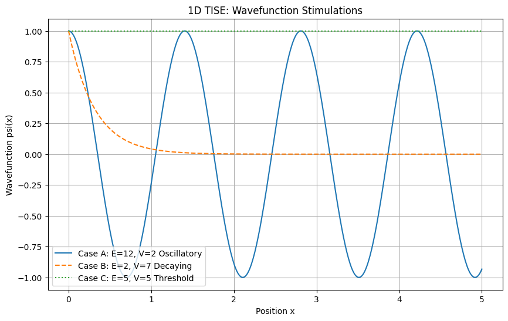
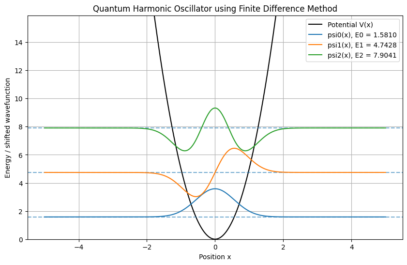

# Week 1 Assignment Submission

---

# Part 1 - NumPy & Linear Algebra: Gram-Schmidt Orthonormalization

### File
- [View Python File](./gram_schmidt.py)
- ## Output

```text
[[ 1.          0.          0.        ]
 [ 0.          0.70710678 -0.70710678]
 [ 0.          0.70710678  0.70710678]]
```

```text
[[1.0000000e+00 0.0000000e+00 0.0000000e+00]
 [0.0000000e+00 1.0000000e+00 2.3489154e-16]
 [0.0000000e+00 2.3489154e-16 1.0000000e+00]]
```

```text
True
```

---

# Part 2 - Pandas & Visualization: The Submission Delay Dataset

### File
- [View Python Notebook](./data_exploration_and_modeling.ipynb)

---

# Phase 2 - Feature Correlations & Heatmaps

## Summary

The heatmap represents the correlation matrix among the top 15 features and the target variable.

Correlation values range from **-1 to +1**:

- Positive values indicate direct linear relationships between features.
- Negative values indicate inverse relationships between features.

---

## Multicollinearity

Multicollinearity occurs when two or more independent features are highly correlated and essentially represent similar information or the same underlying idea.

### Problems Caused by Multicollinearity

When highly correlated features are kept together in the dataset:

- The same underlying information gets counted multiple times.
- This causes unrealistic weightage for that information during prediction.
- Model coefficients become unstable.
- Feature importance becomes misleading.

Since duplicate features strongly influence the prediction process:

- Variance increases.
- The model becomes highly sensitive to small feature changes.
- Training performance may improve artificially.
- The model may begin fitting noise instead of true patterns.

This ultimately leads to:

- Overfitting
- Poor generalization performance on unseen data

---

# Phase 3 - Dimensionality Reduction (UMAP vs. t-SNE)

## Why UMAP Preserves Global Structure Better

### t-SNE

- t-SNE mainly focuses on preserving local neighbourhood relationships.
- It does not preserve the overall global geometry effectively.
- In the visualization, clusters appear isolated like floating islands.
- Distances between clusters are often inconsistent.

### UMAP

- UMAP preserves both local structure and global topology.
- The manifold structure appears more organized.
- Relative positions between groups remain more stable.
- Similar groups stay closer globally.

---

## Observations from the Plots

In both plots:

- Late and on-time submission points do not form perfectly clean clusters.

However:

- The UMAP visualization using 100 features appears to produce cleaner and better-separated clusters.

---

## Interpretation

Using more features provides more information to the embedding algorithms.

As a result:

- The clusters become more detailed.
- The geometric organization becomes more meaningful.
- Natural separation between groups improves.

# Part 3 - Predictive Modeling & Evaluation

# Deconstructing the Metrics

| Model | Accuracy | Precision (Class 1) | Recall (Class 1) | F1-Score (Class 1) | AUC-ROC |
|---|---|---|---|---|---|
| Logistic Regression | 0.864198 | 0.000000 | 0.000000 | 0.000000 | 0.706088 |
| Support Vector Machine (SVC) | 0.864198 | 0.000000 | 0.000000 | 0.000000 | 0.887662 |
| Random Forest Classifier | 0.919753 | 0.909091 | 0.454545 | 0.606061 | 0.984253 |

---

## Accuracy

Accuracy measures how many predictions made by the model were correct overall.

For this specific problem, accuracy represents how effectively the model predicts both:

- True Positives
- True Negatives

out of all submissions.

A high accuracy indicates that the model correctly identifies most submissions overall.

However, accuracy alone can sometimes be misleading when the dataset is imbalanced.

For example:

- If most submissions are on time,
- the model may achieve high accuracy simply by predicting every submission as "on time".

In such cases:

- late submissions may remain undetected,
- even though the reported accuracy appears high.

This becomes problematic when the objective is specifically to identify risky or late submissions.

---

## Precision

Precision measures how many submissions predicted as **late** were actually late.

For the **Random Forest Classifier**:

- Precision = **0.909091**

This indicates that most late-submission alerts generated by the model are trustworthy.

### Importance of High Precision

High precision helps:

- reduce false alarms,
- avoid unnecessary interventions,
- improve operational efficiency.

This is important because administrators or institutions can confidently rely on the generated alerts.

---

## Recall

Recall measures how many actual late submissions were successfully identified by the model.

For the **Random Forest Classifier**:

- Recall = **0.454545**

This means:

- more than half of the actual late submissions are still being missed.

As a result:

- potentially risky students or employees may not be flagged in time,
- reducing the effectiveness of preventive action.

The **Logistic Regression** and **SVC** models achieved:

- Recall = **0**

meaning they completely failed to identify any late submissions.

---

## F1-Score

The F1-score combines Precision and Recall into a single balanced metric.

For the **Random Forest Classifier**:

- F1-score = **0.606061**

This indicates a moderate balance between:

- identifying late submissions,
- and avoiding false alarms.

### Interpretation

- The Random Forest model performs reasonably well overall.
- However, it still misses many actual late cases.
- It performs significantly better than Logistic Regression and SVC, both of which achieved an F1-score of 0 due to failing to detect Class 1 instances.

---

## AUC-ROC

The AUC-ROC score measures the model’s ability to distinguish between:

- late submissions,
- and on-time submissions.

For the **Random Forest Classifier**:

- AUC-ROC = **0.984253**

This indicates:

- extremely strong classification capability,
- excellent separability between the two classes,
- and highly reliable ranking performance.

Among all evaluated models, the Random Forest Classifier demonstrates the strongest predictive capability overall.

# Model Selection

## Why Random Forest Performed Better

Random Forest performed well on this problem because human behavior is rarely linear.

In real-world scenarios, outcomes such as:

- late submissions,
- disengagement,
- or reduced productivity

are usually influenced by combinations of interacting factors rather than by a single independent variable.

Random Forest is built using multiple decision trees that make predictions through sequences of conditional rules.

Each decision tree learns patterns by repeatedly splitting the dataset using feature-based questions.

This hierarchical decision-making structure allows the model to:

- capture conditional relationships between variables,
- learn complex interactions,
- and avoid assuming that all features contribute independently and linearly.

---

## Ensemble Learning Advantage

Random Forest further improves this capability through ensemble learning.

Instead of relying on a single decision tree:

- multiple trees are trained,
- each using random subsets of data and features.

As a result:

- different trees learn different local patterns,
- prediction robustness increases,
- overfitting reduces,
- and generalization performance improves.

The final prediction is generated through collective voting across all trees.

This makes Random Forest highly effective for modeling diverse and non-linear behavioral patterns.

---

## Why Logistic Regression Performed Poorly

Logistic Regression struggled because the dataset was highly imbalanced.

The majority class contained significantly more samples than the minority class.

Logistic Regression learns by minimizing overall prediction error using gradient descent optimization.

Because the majority class dominates the dataset:

- the optimization process mainly focuses on majority-class patterns,
- minority-class examples contribute very little to gradient updates.

As a result:

- the model learns to favor majority predictions,
- minority-class probabilities remain very low,
- and many actual late submissions are misclassified.

In practice, the model effectively chooses the “safer” strategy:

- predicting most samples as belonging to the majority class.

This leads to poor minority-class detection performance.

---

## Why Support Vector Machine (SVM) Performed Poorly

Support Vector Machine also struggled due to class imbalance.

SVM attempts to construct a single global decision boundary that separates classes with maximum margin.

However:

- the majority class heavily influenced the boundary,
- while minority-class samples were sparse and scattered across the feature space.

Since the minority samples did not form a strong, clearly separable structure:

- SVM treated many minority points as noise or outliers,
- causing them to fall inside the majority-class decision region.

This resulted in:

- frequent misclassification of minority samples,
- poor recall performance,
- and failure to effectively detect late submission behavior.

---

# Practical Applications

## Human Disengagement Detection

The Random Forest model can be practically used to identify human disengagement patterns that may lead to:

- late submissions,
- reduced productivity,
- or declining participation.

In real-world environments such as:

- educational institutions,
- workplaces,
- or organizational systems,

disengagement rarely appears in one uniform pattern.

Different individuals often display:

- different behavioral signals,
- different interaction styles,
- and different progression paths toward disengagement.

---

## Why Tree-Based Models Work Well

Tree-based models like Random Forest are highly effective in such scenarios because:

- they capture multiple local behavioral patterns,
- instead of relying on one single global relationship.

Multiple decision paths allow the model to:

- detect small groups of disengaged individuals,
- identify subtle variations in behavior,
- and adapt to heterogeneous human patterns.

This flexibility makes Random Forest particularly suitable for behavioral prediction tasks.

---


# More Features

| Model | Accuracy | Precision (Class 1) | Recall (Class 1) | F1-Score (Class 1) | AUC-ROC |
|---|---|---|---|---|---|
| Logistic Regression | 0.867284 | 1.00 | 0.022727 | 0.044444 | 0.870455 |
| Support Vector Machine (SVC) | 0.864198 | 0.00 | 0.000000 | 0.000000 | 0.834334 |
| Random Forest Classifier | 0.876543 | 0.75 | 0.136364 | 0.230769 | 0.899107 |

---

## Effect of Adding More Features

When all features were included:

- Logistic Regression showed slight improvement.
- Random Forest performance decreased slightly.

This behavior can be explained by how these models learn patterns from data.

---

## Why Logistic Regression Improved

Logistic Regression improved because the additional features provided more global information that helped the model estimate minority-class probabilities more effectively.

Since Logistic Regression is a linear model:

- it attempts to learn one overall relationship between features and the target variable.

Earlier, with fewer features:

- the model lacked sufficient information to distinguish late submissions properly,
- causing it to predict mostly the majority class.

Although the model improved slightly, it still fails to identify most late-submission cases reliably.

---

## Why Random Forest Performance Decreased

Random Forest performance decreased slightly after including all features because tree-based models are sensitive to:

- noisy features,
- irrelevant features,
- and weakly informative variables.

Random Forest constructs many decision trees using random subsets of features.

When too many features are added:

- some trees may begin learning noisy or unimportant patterns,
- instead of meaningful disengagement behavior.

This weakens the model’s ability to generalize effectively.

Even though overall accuracy remained high, the model became less effective at detecting late submissions.

---
# Part 4 - NumPy in Physics: Simulating Quantum Wavefunctions

### Files
- [View Python File](./tise.py)

### Visualization


---

## Observations

Higher energy corresponds to a larger wave number \(k\).

As \(k\) increases:

- the cosine wave oscillates more rapidly,
- more oscillations occur within the same spatial distance,
- and the wavefunction exhibits a higher oscillation frequency.

---

## Barrier Penetration Interpretation

A rapidly decaying wavefunction inside the potential barrier indicates that:

- the probability of finding the electron decreases very quickly inside the barrier region,
- and the electron is highly unlikely to penetrate deeply into the high-resistance region.

---

# Bonus Part - Numerical Quantum Mechanics: The Finite Difference Method

### Files
- [View Python File](./bonus.py)

### Visualization


---

# Numerical Output

```text
Lowest three energy levels:

E0 = 1.581013
E1 = 4.742789
E2 = 7.904062
```

---

# Comparison with Theoretical Ground State Energy

As per all the info provided, the theoretical ground state energy is: E_0 = 1.58113883. The numerically computed ground state energy is: E_0 = 1.581013. The numerical result is extremely close to the theoretical prediction. The small difference occurs because the continuous Schrodinger equation was approximated using a finite spatial grid in the finite difference method. 

---

# Relationship Between Quantum Number and Nodes

The first three wavefunctions exhibit the expected node structure:

- psi_0 has 0 nodes
- psi_1 has 1 node
- psi_2 has 2 nodes

Therefore, the exact mathematical relationship is:

Number of nodes = n
where:
n is the quantum state index. This is a fundamental property of quantum harmonic oscillator eigenfunctions.

